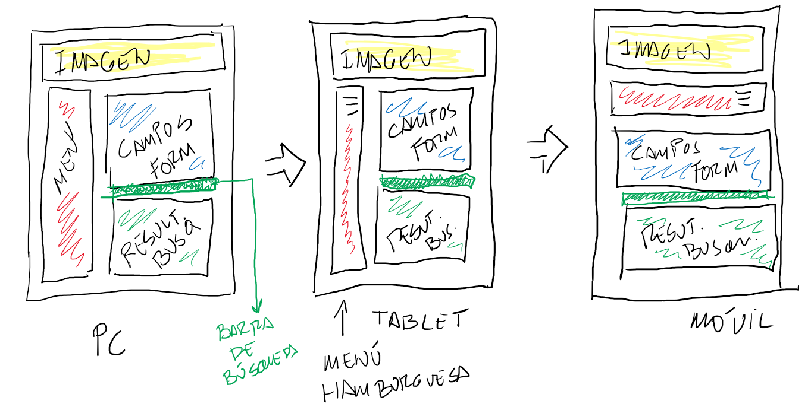

# Evaluación final DWEC / DIW

Diseña una aplicación responsive que resuelva el siguiente supuesto.

Tenemos una consulta médica que debemos automatizar. Hemos realizado una entrevista con el propietario y obtenemos el siguiente análisis de requisitos:

- Debe ser una página web responsive
- Se deben almacenar los siguientes datos de los pacientes, validando los siguientes campos:
    - Nombre. Debe permitir tildes y espacios en blanco
    - Apellido. Debe permitir tildes y espacios en blanco.
    - Tel fijo. Se debe almacenar con este formato 999999999.
    - Tel móvil. Se debe almacenar con este formato 999999999.
    - E-mail. Validar
    - E-mail. Se repite el campo E-mail para comprobar que se han tecleado correctamente.
    - Observaciones. Como máximo se pueden escribir 200 caracteres y se deben contabilizar el número de caracteres introducidos hasta el momento.
- En cumplimiento de la normativa A, de usabilidad es necesario que:
    - El nombre y el apellido deben mostrarse con el primer caracter en mayúsculas.
    - Cuando se carga el formulario el foco debe estar en el primer campo.
    - La navegación entre campos debe tener un orden natural
    - La información proporcionada al usuario en caso de error en la validación de algún campo del formularo deber ser breve y concisa.
    - Cuando se carga el formulario después de agregar un registro, los campos deben ser reseteados.
- Estos registros deben almacenarse en una BBDD.
- La web debe tener un buscador que filtre los usuarios por apellido y que muestre el resultado en pantalla, sin tener que recargar la página. (AJAX).

## Diseño WEB

Realiza un diseño web acorde con las especificaciones del cliente, debes tener en cuenta los diferentes tamaños de los medios.

- En el menu principal deben aparecer tres enlaces no funcionales: Inicio, Agenda y Salir.
- El formulario debe estar centrado en la pantalla.
- La imagen no debe ser de más de 200px de alto aproximadamente.
- El contenedor menú debe mostrarse como "Hamburguesa" en los formatos tablet y Móvil
- La barra de búsqueda se situará justo encima de los resultados de búsqueda
- El contenido de la web debe ser proporcionado a la información que se muest

## Criterios de calificación

| Criterios calificación |  |  |  |  |  
|---|---|---|---|---|
| Validación de campos | Valida 1 campo o menos | Valida 2 campos | Valida 3 campos | Valida todos los campos |  
| Mensajes de error |   No se controlan los mensajes de error | Los campo de error se muestran y se ocultan cuando corresponde, pero el texto no es adecuado | Los mensajes de error son correctos y se ocultan y muestran cuando corresponde |  
| Conexión a la BBDD |   No hay acceso a la base de datos u otros errores | Se insertan y leen campos de la BBDD | Se insertan y se leen campos de la BBDD |  
| AJAX |   No se emplea AJAX | Para el listado o la inserción de datos no es necesario recargar la página | Tanto para el listado como para la inserción no es necesario recargar la página |  
| Diseño responsive |  El diseño no es responsive | El diseño se ajusta completamente a PC y tablet | El diseño se ajusta completamente a PC, móviles y tablets. |  
| El nombre y el apellido deben mostrarse con el primer caracter en mayúsculas | No | Si | 
| Al cargar el formularo el foco debe estar en el primer campo | No | Si |  |  
| La navegación debe tener un orden natural | No | Sí |
| Después de agregar un registro los campos deben ser reseteados | No | Sí | 
| Diseño según plantilla | No | 33% | 66% | 100% | 